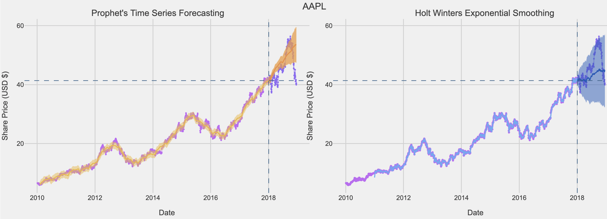
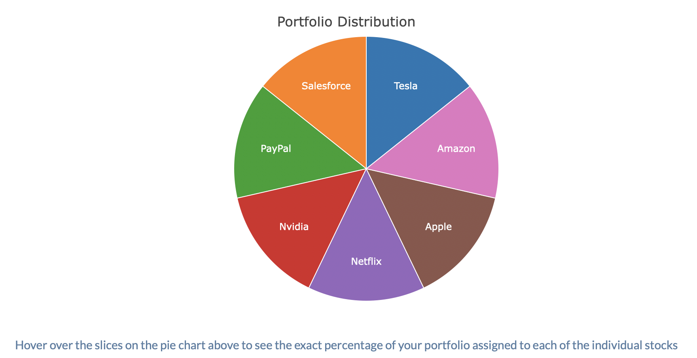
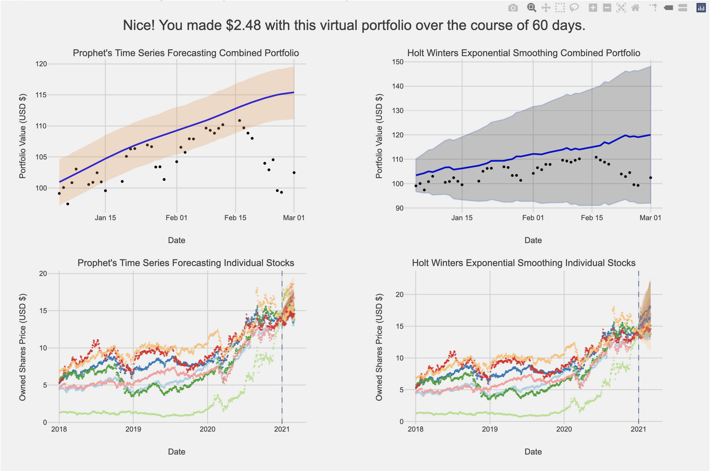

# A Shiny App for Stock Market Forecasting

I created this application as my Capstone project to obtain my undergraduate degree (major in Computer Science) at Minerva Schools at KGI.

The purpose of this application is to enables its users to explore the stock market and some of the forecasting models that have been used to predict it. The principal intended audience is Mexicans that belong to the Economically Active Population (PEA) and thus I have created a version of the app in Spanish and English. 

The application has two main features. The first one is the analysis of historical data and prediction algorithms for this data. The second one is an investment portfolio simulation that also uses forecasting algorithm analysis. The first feature allows users to see historical data of the stock price of various stocks. For example, the user can select a time period from January 2018 to December 2020, and look at the price of an Apple stock during that period. Furthermore, the user can see the predicted price for a given prediction horizon based on two different commonly used financial forecasting techniques. 



The second feature allows the user to simulate investment portfolios. That is, if the user wants to know how an investment of a combination of stocks would have turned out for a given period, the user can simulate it and compare it with the predictions made by the models. 




If you are interested in knowing more about how I built the application, please refer to the white paper below.

## White Paper


## Installation

If you wish to reproduce the application, you can download either the folder [two_file_app](https://github.com/jccf12/Capstone/tree/master/two_file_app) for the application in English, or [two_file_app_spanish](https://github.com/jccf12/Capstone/tree/master/two_file_app_spanish) for the application in Spanish. You will need to install some packages to run the application locally.

You can install the necessary packages from CRAN as follows:

```r
install.packages("bookdown")
```

## Usage

## Getting help

If you have any questions, please do not hesitate to shoot me an email at juan.castrofernandez@minerva.kgi.edu 

